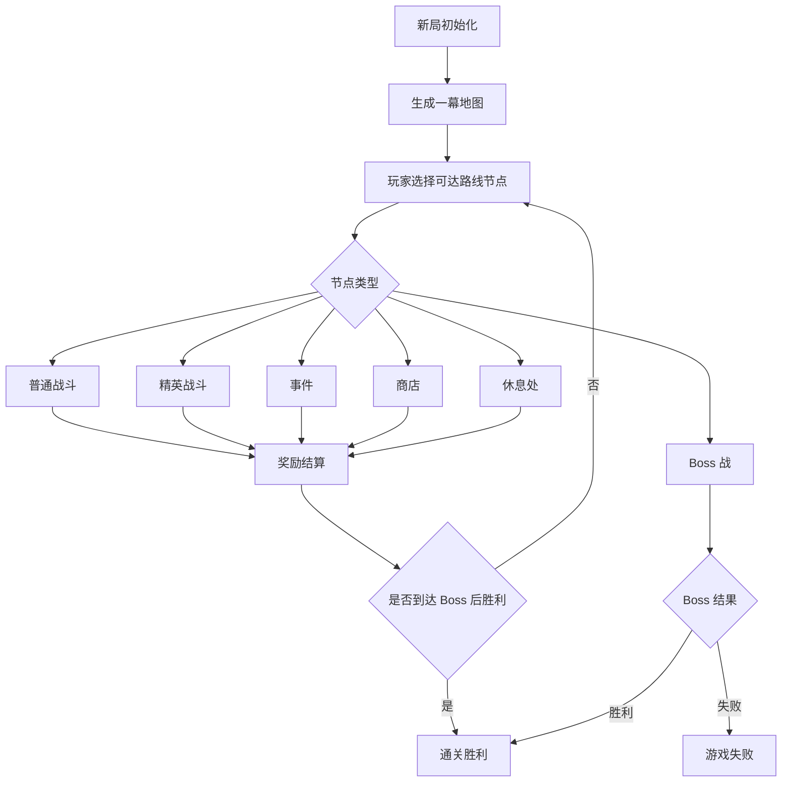
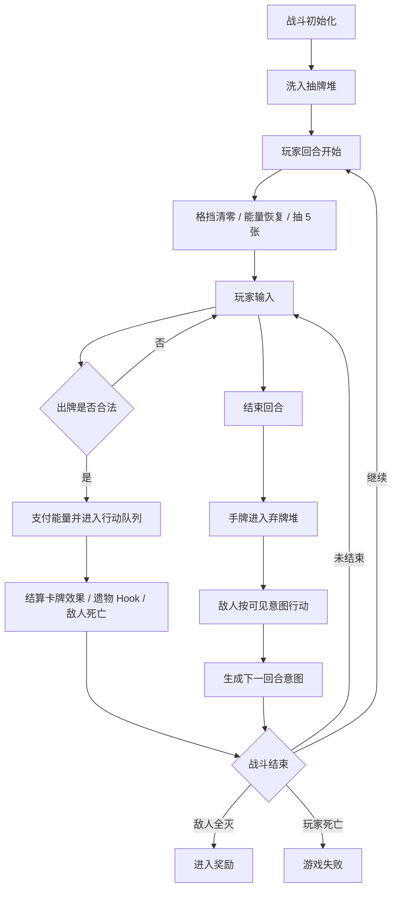

# 第 1 轮 · PRD · 杀戮尖塔 Like 网页核心循环

| 字段 | 内容 |
|---|---|
| 文档版本 | v1.0 |
| 创建日期 | 2026-05-30 |
| 目标阶段 | V1 单人网页 MVP |
| 目标读者 | AI 编程 Agent / 前端实现者 / QA |
| 配套背景 | `PROJECT_STRUCTURE.md`、`杀戮尖塔-实现逻辑与架构拆解.md` |
| 非职责范围 | 本文不负责最终商业美术资产打磨、正式音频，不改代码；但 V1 必须要求真实可用的 Image2 生成游戏素材 |

---

## 一、产品概述

本产品是一个跑在网页里的单人卡牌爬塔 MVP。目标不是完整复刻商业游戏，而是先跑通“一幕爬塔核心循环”：

```text
开始新局
  -> 生成一幕地图
  -> 选择路线节点
  -> 进入战斗 / 精英 / 事件 / 商店 / 休息
  -> 结算奖励或损失
  -> 更新整局状态
  -> 推进到 Boss
  -> 胜利或失败
```

V1 的成功标准：

- 玩家可以在浏览器中完成一局 12 层一幕爬塔。
- 战斗具备完整卡牌循环：抽牌、出牌、弃牌、洗牌、敌人意图、回合切换、胜负判定。
- 路线选择能影响风险和收益：普通战斗、精英、事件、商店、休息、Boss。
- 奖励能影响后续战斗：选牌、金币、遗物、删牌、升级、回血。
- 整局状态可本地保存并恢复。
- 所有玩法数据先用本地静态配置，不依赖服务端。

---

## 二、产品假设与 MVP 锁定数值

### 2.1 产品假设

| 项 | 锁定 |
|---|---|
| 平台 | 桌面优先的网页游戏，移动端只要求可显示，不要求完整适配 |
| 模式 | 单人离线本地游戏 |
| 内容范围 | 仅一幕，不做二幕、三幕和隐藏 Boss |
| 角色 | 仅 1 个默认角色 |
| 剧情 | 不做复杂剧情，仅保留事件短文案 |
| 联网 | 不登录、不联网、不排行榜、不云存档 |
| 付费 | 不做内购、不做广告、不做付费点 |

### 2.2 MVP 数值锁定

| 类别 | 数值 |
|---|---:|
| 初始最大 HP | 70 |
| 初始当前 HP | 70 |
| 初始金币 | 99 |
| 每回合基础能量 | 3 |
| 每回合基础抽牌 | 5 |
| 最大手牌数 | 10 |
| 初始牌组 | 5 张打击、4 张防御、1 张猛击，共 10 张 |
| 普通战斗奖励金币 | 10-18 |
| 精英战斗奖励金币 | 25-35 |
| Boss 奖励金币 | 50 |
| 战斗卡牌奖励 | 3 选 1，可跳过 |
| 最小卡牌池规模 | 24 张，其中攻击 10、技能 10、能力 4 |
| 最小遗物池规模 | 12 个 |
| 最小敌人规模 | 普通敌人 6 组、精英 2 组、Boss 1 组 |
| 地图层数 | 12 层，第 12 层固定 Boss |
| 每层节点数 | 3-5 个 |
| 路线分支 | 每个节点连接下一层 1-3 个节点 |
| 休息处行为 | 回血 30% 最大 HP，或升级 1 张牌 |
| 商店商品 | 3 张卡、3 个遗物、1 次删牌服务 |
| 删牌价格 | 75 金币，V1 不递增 |
| 事件数量 | 至少 5 个 |
| 存档槽 | 1 个当前局存档 |

---

## 三、核心玩法循环

### 3.1 整局循环



### 3.2 战斗循环



---

## 四、功能模块

### M1 · 新局与整局状态 Run

目标：创建和维护一局爬塔的全局状态。

锁定规则：

- 点击“开始新局”后创建 `RunState`。
- 新局使用随机种子；开发模式允许在 URL 或调试面板输入 seed。
- `RunState` 必须可 JSON 序列化。
- 当前 HP、最大 HP、金币、主牌组、遗物、地图、当前位置、事件标记、随机种子都属于整局状态。
- 战斗中的手牌、抽牌堆、弃牌堆不直接写入整局状态，除非正在保存战斗中断状态。

建议数据结构：

```ts
type RunState = {
  seed: number;
  floor: number;
  hp: number;
  maxHp: number;
  gold: number;
  map: MapGraph;
  currentNodeId: string | null;
  availableNodeIds: string[];
  masterDeck: CardInstance[];
  relics: RelicInstance[];
  flags: Record<string, unknown>;
  status: "map" | "combat" | "reward" | "shop" | "rest" | "event" | "victory" | "defeat";
};
```

### M2 · 战斗系统 Combat

目标：实现回合制卡牌战斗。

锁定规则：

- 玩家每回合开始：格挡清零、能量恢复为 3、抽 5 张。
- 手牌上限 10；超出上限的抽牌直接停止，不丢弃已有手牌。
- 出牌必须检查阶段、费用、目标、卡牌可用性。
- 卡牌效果进入行动队列后结算，不允许直接递归修改多个系统。
- 玩家点击“结束回合”后，所有手牌进入弃牌堆。
- 敌人按回合开始时展示的意图行动。
- 任一时刻玩家 HP <= 0，进入失败。
- 全部敌人 HP <= 0，进入奖励。

战斗状态：

```ts
type CombatState = {
  turn: number;
  phase:
    | "init"
    | "player_turn_start"
    | "player_input"
    | "resolving_actions"
    | "player_turn_end"
    | "enemy_turn"
    | "checking_end"
    | "finished";
  player: PlayerCombatant;
  enemies: EnemyCombatant[];
  energy: number;
  block: number;
  drawPile: CardInstance[];
  hand: CardInstance[];
  discardPile: CardInstance[];
  exhaustPile: CardInstance[];
  actionQueue: GameAction[];
};
```

### M3 · 卡牌系统 Cards

目标：提供最小可构筑卡牌池，并支持升级。

初始牌组锁定：

| 卡牌 | 数量 | 费用 | 效果 |
|---|---:|---:|---|
| 打击 | 5 | 1 | 对单个敌人造成 6 点伤害；升级后 9 点 |
| 防御 | 4 | 1 | 获得 5 点格挡；升级后 8 点 |
| 猛击 | 1 | 2 | 造成 8 点伤害并给予 2 层易伤；升级后 10 点伤害、3 层易伤 |

MVP 卡牌池要求：

- 至少 24 张可奖励卡牌，不含初始牌。
- 稀有度：普通 14、罕见 7、稀有 3。
- 类型：攻击 10、技能 10、能力 4。
- 至少覆盖以下效果：伤害、格挡、抽牌、获得能量、施加易伤、施加虚弱、获得力量、获得敏捷、消耗自身、全体伤害。
- 每张卡必须有 `id`、名称、费用、类型、稀有度、目标类型、未升级效果、升级效果、描述文案。

卡牌实例规则：

- 同名多张牌必须有不同 `uuid`。
- 升级状态在实例上保存。
- 战斗中的临时费用变化不写回主牌组。

### M4 · 敌人与意图系统 Enemies

目标：让玩家能根据敌人下一步行动做防御/攻击决策。

敌人规模锁定：

| 类型 | 数量 | 示例定位 |
|---|---:|---|
| 普通敌人组 | 6 | 单体攻击、多敌人、小怪加防、虚弱施加、成长型敌人、爆发型敌人 |
| 精英敌人 | 2 | 高伤害检验、持续成长检验 |
| Boss | 1 | 多阶段高血量检验 |

意图锁定：

- 每个敌人每回合必须展示下一步意图。
- 意图至少包括：攻击、防御、攻击+负面、强化、未知。
- 攻击意图必须显示预估伤害，例如 `攻击 8`、`攻击 4x2`。
- 敌人行动从候选动作中按权重选择，但必须支持冷却和连续次数限制。

推荐数据：

```ts
type EnemyMove = {
  id: string;
  intent: "attack" | "block" | "attack_debuff" | "buff" | "unknown";
  baseDamage?: number;
  hits?: number;
  block?: number;
  effects: EffectDef[];
  weight: number;
  cooldown?: number;
  maxConsecutive?: number;
};
```

### M5 · 地图与路线 Map

目标：实现一幕 12 层可选择路线。

地图锁定：

- 第 1 层固定普通战斗。
- 第 6 层至少出现 1 个休息处。
- 第 11 层固定休息处。
- 第 12 层固定 Boss。
- 第 2-10 层混合普通战斗、精英、事件、商店、休息、宝箱。
- 每层 3-5 个节点。
- 节点只连接下一层节点，不允许回退。
- 玩家只能点击当前节点连接到的下一层节点。

节点比例建议：

| 节点 | 比例 |
|---|---:|
| 普通战斗 | 45% |
| 事件 | 20% |
| 精英 | 12% |
| 商店 | 10% |
| 休息 | 8% |
| 宝箱 | 5% |

### M6 · 奖励系统 Rewards

目标：战斗后给予构筑成长选择。

普通战斗奖励：

- 金币 10-18。
- 3 张卡牌奖励，玩家选择 1 张加入主牌组。
- 玩家可以跳过卡牌。

精英奖励：

- 金币 25-35。
- 3 张卡牌奖励，稀有牌概率高于普通战斗。
- 固定获得 1 个遗物。

Boss 奖励：

- 击败后直接胜利。
- 胜利页展示最终牌组、遗物、剩余 HP、用时、路线节点数量。

奖励界面要求：

- 所有奖励必须逐项领取或跳过后才能继续。
- 卡牌奖励必须展示费用、类型、效果描述、升级预览入口。
- 已选择的卡牌立即写入 `RunState.masterDeck`。

### M7 · 遗物系统 Relics

目标：提供跨战斗的被动规则修改器。

MVP 规模：

- 至少 12 个遗物。
- 至少覆盖以下触发时机：战斗开始、回合开始、出牌后、受到伤害后、战斗胜利后、拾取时。
- 每个遗物必须有名称、描述、稀有度、触发 Hook、效果。

示例遗物方向：

| 遗物方向 | 效果边界 |
|---|---|
| 开局加防 | 每场战斗开始获得 6 格挡 |
| 能量遗物 | 每场战斗第 1 回合获得 1 能量 |
| 金币遗物 | 战斗奖励金币 +25% |
| 抽牌遗物 | 第 1 回合多抽 1 张 |
| 攻击遗物 | 每场战斗第一次攻击额外 +4 伤害 |

硬约束：

- 遗物不得直接写死在卡牌逻辑里。
- 遗物效果通过 Hook 或统一效果系统接入。
- 同一遗物 V1 不重复获得。

### M8 · 商店 / 休息 / 事件 / 宝箱

目标：提供非战斗资源转换节点。

商店锁定：

- 展示 3 张卡牌、3 个遗物、1 个删牌服务。
- 普通卡 50 金币，罕见卡 75 金币，稀有卡 120 金币。
- 遗物价格 150-250 金币。
- 删牌服务 75 金币。
- 金币不足时按钮禁用并显示价格。
- 离开商店后不能返回。

休息处锁定：

- 二选一：休息或升级。
- 休息：恢复最大 HP 的 30%，向上取整，不超过最大 HP。
- 升级：从主牌组选择 1 张未升级卡牌升级。
- 如果没有可升级卡，升级按钮禁用。

事件锁定：

- 至少 5 个事件。
- 每个事件 2-3 个选项。
- 事件选项必须明确展示代价和收益。
- 事件可产生：回血、失血、金币变化、删牌、升级、获得遗物、获得诅咒。

宝箱锁定：

- 直接获得 1 个遗物。
- 点击确认后返回地图。

### M9 · 全局状态机

目标：避免页面流程混乱，保证每个阶段只允许对应操作。

状态枚举：

| 状态 | 含义 | 允许操作 | 转出 |
|---|---|---|---|
| `boot` | 应用启动 | 读存档 / 新局 | `title` / `map` |
| `title` | 标题页 | 开始新局 / 继续 | `map` |
| `map` | 地图页 | 选择可达节点 | `combat` / `shop` / `rest` / `event` / `chest` |
| `combat` | 战斗页 | 出牌、选目标、结束回合 | `reward` / `defeat` |
| `reward` | 奖励页 | 选卡、跳过、领金币遗物 | `map` / `victory` |
| `shop` | 商店页 | 购买、删牌、离开 | `map` |
| `rest` | 休息页 | 回血或升级 | `map` |
| `event` | 事件页 | 选择事件选项 | `map` / `combat` / `reward` |
| `chest` | 宝箱页 | 领取遗物 | `map` |
| `victory` | 胜利页 | 查看总结、重新开始 | `title` |
| `defeat` | 失败页 | 查看总结、重新开始 | `title` |

硬约束：

- UI 不得通过隐藏按钮绕过状态机。
- 状态转换必须集中管理，不允许散落在组件里直接跳转。
- 任何非法状态转换必须记录 console warning，并保持当前状态。

### M10 · 本地存档与设置

目标：允许玩家刷新后继续当前局。

存档锁定：

- 使用 `localStorage`。
- 当前局 key：`spirelike.run.v1`。
- 设置 key：`spirelike.settings.v1`。
- 每次进入新节点、完成奖励、商店购买、休息选择、事件选择后自动保存。
- 战斗中每次回合开始自动保存；刷新后恢复到该回合开始状态。
- 新局会覆盖旧存档，但必须弹出确认。

设置锁定：

- 动画速度：`normal` / `fast`，默认 `normal`。
- 调试信息：默认关；开启后显示 seed、状态机状态、当前层数。
- V1 不接真实音频资源，不提供音效开关；如工程预留设置字段，必须默认关闭且不在 UI 中展示。

---

## 五、UI 布局要求

本文只定义信息布局，不定义最终视觉风格。

### 5.1 全局布局

- 应用占满浏览器视口，避免页面级滚动；局部列表可滚动。
- 顶部或侧边必须持续显示：HP、金币、层数、遗物数量、牌组数量。
- 所有主流程页面必须有明确主操作按钮。
- 禁用态按钮必须可见，不能直接隐藏。

### 5.2 战斗页布局

战斗页必须包含：

- 顶部：敌人区域，显示敌人 HP、格挡、状态、下一回合意图。
- 中部：行动反馈区，展示伤害、格挡、状态变化和关键动画。
- 底部：玩家手牌区，展示费用、名称、描述。
- 左侧或顶部 HUD：玩家 HP、格挡、能量、抽牌堆、弃牌堆、消耗堆。
- 右侧或底部操作：结束回合、查看牌组、查看遗物。

### 5.3 地图页布局

地图页必须包含：

- 12 层节点纵向推进。
- 当前可选节点高亮。
- 不可达节点置灰。
- 节点类型图标或文字清晰可区分。
- 悬停或点击节点时显示节点类型说明。

### 5.4 奖励页布局

奖励页必须包含：

- 金币奖励区。
- 卡牌 3 选 1 区。
- 遗物奖励区。
- 跳过卡牌按钮。
- 继续按钮：未处理必要奖励前禁用。

---

## 六、关键交互与动效

### 6.1 战斗交互

- 点击手牌后，如果无需目标且费用足够，直接打出。
- 需要目标的牌：点击卡牌后进入选目标状态，再点击敌人确认。
- 选目标状态下点击空白或按 Esc 取消。
- 费用不足时卡牌不可打出，并给出轻微抖动或红色提示。
- 回合结算中禁止继续出牌。

### 6.2 动效要求

V1 动效只服务清晰反馈，不追求华丽。

必须实现：

- 出牌移动到结算区。
- 伤害数字从目标上方弹出。
- 格挡增加时 HUD 数字跳动。
- 敌人行动前意图短暂高亮。
- 抽牌、弃牌、洗牌有最小过渡反馈。
- 胜利和失败有明确页面切换。

可延后：

- 粒子特效。
- 复杂镜头运动。
- 逐帧角色动画。
- 音频系统。

---

## 七、文案锁定

| 场景 | 文案 |
|---|---|
| 标题 | 卡牌爬塔 MVP |
| 开始按钮 | 开始新局 |
| 继续按钮 | 继续游戏 |
| 地图标题 | 选择下一条路线 |
| 普通战斗 | 普通战斗 |
| 精英 | 精英 |
| 事件 | 事件 |
| 商店 | 商店 |
| 休息处 | 休息处 |
| 宝箱 | 宝箱 |
| Boss | Boss |
| 结束回合 | 结束回合 |
| 能量 | 能量 |
| 格挡 | 格挡 |
| 抽牌堆 | 抽牌堆 |
| 弃牌堆 | 弃牌堆 |
| 消耗堆 | 消耗堆 |
| 选择一张卡牌 | 选择一张卡牌加入牌组 |
| 跳过奖励 | 跳过 |
| 离开商店 | 离开商店 |
| 休息 | 休息：恢复 30% 最大生命 |
| 升级 | 升级一张牌 |
| 胜利 | 你登上了塔顶 |
| 失败 | 你倒在了塔中 |
| 重新开始 | 重新开始 |

---

## 八、范围边界

### 8.1 V1 必做

- 一幕 12 层地图。
- 1 个默认角色。
- 初始牌组和至少 24 张奖励卡。
- 普通战斗、精英、Boss。
- 敌人意图。
- 奖励选卡。
- 遗物。
- 商店。
- 休息处。
- 事件。
- 宝箱。
- 本地存档。
- 胜利 / 失败总结页。
- V1 必须使用真实可用的本地 Image2 生成素材，不允许用占位符、纯色块、emoji、文本符号、Lucide 或临时 SVG 替代世界观素材。

### 8.2 V1 素材范围与管线

V1 不要求最终商业美术资产和正式宣发级打磨，但核心玩法可见素材必须由 Image2 生成并处理为可直接使用的本地游戏资产。

必须覆盖的素材范围：

- 战斗背景。
- 地图背景和地图节点图标。
- 玩家角色立绘或半身像。
- 普通敌人、精英敌人、Boss。
- 商店、休息处、事件页面背景。
- 遗物、金币、宝箱等物品素材。
- 卡牌插画。

素材管线：

```text
Image2 生成
  -> 裁切 / 透明背景处理
  -> 导出 WebP / PNG
  -> 放入本地 assets 目录
  -> 游戏引用本地文件
```

硬性要求：

- 所有背景、物品、人物 / 玩家角色、敌人 / Boss 都必须来自 Image2 生成素材。
- 不允许使用占位符、临时色块、纯文本、emoji、Lucide、本地 SVG 或远程图片替代上述世界观素材。
- Lucide 仅可用于纯 UI 操作图标，例如设置、关闭、返回、确认、信息提示；不可替代地图节点、遗物、金币、宝箱、角色、敌人、Boss、卡牌插画等游戏世界观素材。
- 核心玩法资源必须引用本地 `assets` 文件，不能依赖远程图片地址。

### 8.3 明确不做清单

- 不做登录注册。
- 不做联网对战。
- 不做排行榜。
- 不做云存档。
- 不做付费、广告、内购。
- 不做多角色。
- 不做多幕完整内容。
- 不做复杂剧情和 NPC 对话线。
- 不做药水系统。
- 不做成就系统。
- 不做每日挑战。
- 不做卡牌解锁成长。
- 不做 Mod 支持。
- 不做移动端深度适配。
- 不做音频资源接入。
- 不做最终商业美术资产打磨、正式音频、宣发级角色插画；但 V1 必须具备真实可用的 Image2 生成游戏素材。

---

## 九、验收清单

### 9.1 新局与地图

- [ ] 点击“开始新局”后生成 70/70 HP、99 金币、10 张初始牌组。
- [ ] 地图有 12 层，Boss 固定在第 12 层。
- [ ] 第 1 层只能进入普通战斗。
- [ ] 第 11 层是休息处。
- [ ] 玩家只能选择当前路线可达节点。
- [ ] 选择节点后进入对应页面。

### 9.2 战斗

- [ ] 玩家每回合开始能量为 3。
- [ ] 玩家每回合开始抽 5 张。
- [ ] 打击能造成 6 点伤害，升级后 9 点。
- [ ] 防御能获得 5 点格挡，升级后 8 点。
- [ ] 猛击能造成伤害并施加易伤。
- [ ] 能量不足的卡不能打出。
- [ ] 需要目标的卡必须先选敌人。
- [ ] 点击结束回合后，敌人按意图行动。
- [ ] 抽牌堆为空时会洗入弃牌堆。
- [ ] 敌人全灭进入奖励页。
- [ ] 玩家 HP <= 0 进入失败页。

### 9.3 奖励与成长

- [ ] 普通战斗胜利给 10-18 金币。
- [ ] 普通战斗胜利出现 3 张卡牌奖励。
- [ ] 玩家可选择 1 张卡加入主牌组。
- [ ] 玩家可跳过卡牌奖励。
- [ ] 精英胜利给金币、卡牌奖励和 1 个遗物。
- [ ] 遗物获得后能在后续战斗触发。

### 9.4 商店 / 休息 / 事件

- [ ] 商店展示 3 张卡、3 个遗物、删牌服务。
- [ ] 金币不足时购买按钮禁用。
- [ ] 购买后金币扣除，商品标记已售。
- [ ] 休息能恢复 30% 最大 HP。
- [ ] 升级能选择一张未升级卡并更新效果。
- [ ] 事件至少有 2 个选择，且会改变 RunState。
- [ ] 宝箱能获得 1 个遗物。

### 9.5 状态机与存档

- [ ] 页面状态只通过全局状态机转换。
- [ ] 非法操作不会破坏当前状态。
- [ ] 刷新页面后可以继续当前局。
- [ ] 新局覆盖旧存档前有确认。
- [ ] 失败或胜利后可以重新开始。

### 9.6 UI 与反馈

- [ ] 战斗页能同时看见玩家 HP、能量、格挡、抽牌堆、弃牌堆。
- [ ] 敌人意图始终可见。
- [ ] 卡牌费用、名称、描述清晰可读。
- [ ] 出牌、伤害、格挡、敌人行动有基础反馈。
- [ ] 禁用按钮有明显禁用态。

### 9.7 Image2 素材验收

- [ ] 战斗背景、地图背景、地图节点图标均使用本地 Image2 生成素材。
- [ ] 玩家角色立绘或半身像、普通敌人、精英敌人、Boss 均使用本地 Image2 生成素材。
- [ ] 商店、休息处、事件背景均使用本地 Image2 生成素材。
- [ ] 遗物、金币、宝箱等物品素材均使用本地 Image2 生成素材。
- [ ] 卡牌插画均使用本地 Image2 生成素材。
- [ ] Image2 输出已完成裁切或透明背景处理，并导出为 WebP / PNG。
- [ ] 所有核心玩法素材均放入本地 `assets` 目录并由游戏引用本地文件。
- [ ] 世界观素材中不存在占位符、临时色块、纯文本、emoji、Lucide、本地 SVG 或远程图片替代。

---

## 十、依赖与外部资源

### 10.1 允许依赖

- 前端框架：可使用 React / Vue / Svelte / 原生 TS，由实施者根据工程决定。
- 动画：可使用 CSS transition 或轻量动画库。
- 存储：浏览器 `localStorage`。
- 纯 UI 操作图标：可使用 Lucide，例如设置、关闭、返回、确认、信息提示。
- 世界观素材：必须使用本地 Image2 生成素材，包括背景、地图节点、角色、敌人、Boss、物品和卡牌插画。

### 10.2 禁止依赖

- 不依赖后端服务。
- 不依赖登录态。
- 不依赖远程图片作为核心玩法资源；核心玩法资源必须是 Image2 生成后落地到本地 `assets` 的 WebP / PNG 文件。
- 不依赖付费 API。
- 不把核心规则写在不可版本管理的外部表格里。
- 不使用占位符、临时色块、纯文本、emoji、Lucide 或本地 SVG 替代世界观素材。

---

## 十一、给 AI 实施者的硬约束

1. 先实现可玩的核心循环，再补视觉细节。
2. 不要复用小丑牌、扑克、盲注、Joker、筹码倍率等玩法内容。
3. 所有规则数据必须集中配置，不能散落在 UI 组件里。
4. `RunState`、`CombatState`、卡牌定义、敌人定义、遗物定义必须分层。
5. 卡牌效果走统一效果系统或行动队列，不要每张牌在 UI 里写 if/else。
6. 敌人意图必须在玩家行动前可见。
7. 奖励、商店、休息、事件必须写回整局状态。
8. 存档必须能被 `JSON.stringify` 和 `JSON.parse` 处理。
9. 实现过程中不要引入登录、服务端、支付、排行榜等 V1 范围外能力。
10. 遇到歧义时，以本文锁定数值和验收清单为准，不要临时扩需求。
11. 所有世界观素材必须按 `Image2 生成 -> 裁切 / 透明背景处理 -> 导出 WebP / PNG -> 放入本地 assets -> 游戏引用本地文件` 管线完成，不能用占位符或 UI 图标库替代。

---

## 十二、工程化约束

### 12.1 推荐模块边界

```text
src/
  data/
    cards.ts
    enemies.ts
    relics.ts
    events.ts
  game/
    runState.ts
    combatState.ts
    stateMachine.ts
    actions.ts
    effects.ts
    rng.ts
    mapGenerator.ts
    rewards.ts
    save.ts
  ui/
    pages/
    components/
```

### 12.2 测试优先级

必须优先覆盖：

- 抽牌、弃牌、洗牌。
- 伤害与格挡结算。
- 易伤、虚弱、力量、敏捷等基础状态。
- 卡牌升级。
- 敌人意图选择。
- 地图连接合法性。
- 奖励写回整局状态。
- 存档序列化与恢复。

### 12.3 调试要求

- 开发模式显示 seed。
- 开发模式可打印当前 `RunState.status` 和 `CombatState.phase`。
- 所有状态转换记录简短日志。
- 关键随机结果必须由 seed 驱动，避免不可复现的 bug。

---

## 十三、关键假设

- 本 PRD 面向第 1 轮 MVP，目标是让 AI 编程 Agent 能直接实现核心循环。
- V1 只需要一幕 12 层，不追求商业游戏完整内容量。
- 玩法参考的是卡牌爬塔结构，不复用参考 HTML 中的小丑牌玩法。
- DESIGN 文档负责视觉规范；本文只锁定布局信息、交互要求和 V1 Image2 素材验收，不产出最终商业美术资产打磨或正式音频。
- 所有数据先本地静态化，后续如需内容扩展再考虑数据表或编辑器。
